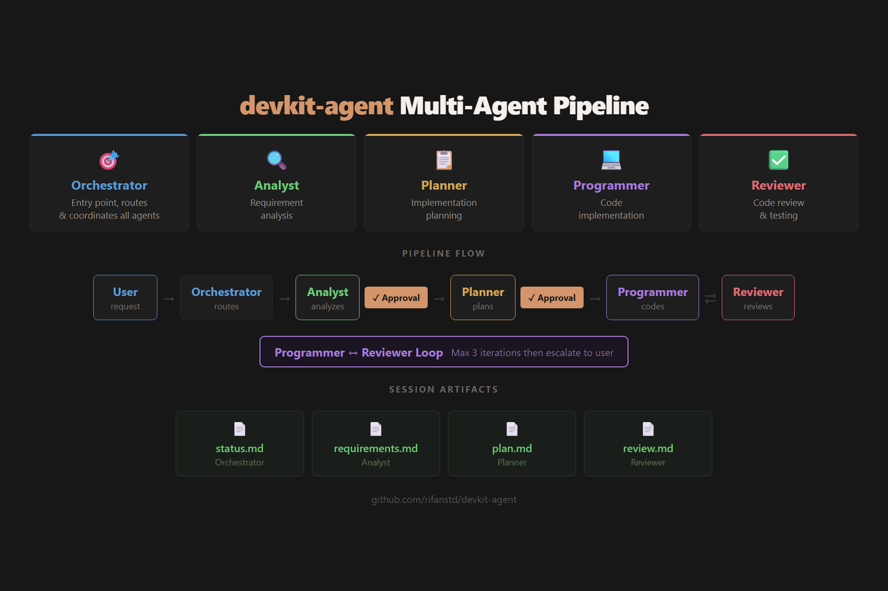
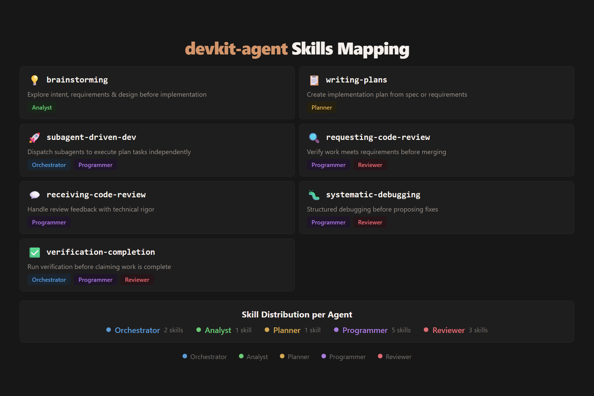

# devkit-agent

Multi-agent coding pipeline for OpenCode. Install agents and skills with one command.

## Installation

```bash
npx devkit-agent
```

## Quick Start

```bash
# Interactive install (recommended)
npx devkit-agent

# Install to global scope
npx devkit-agent -g

# Install all agents without prompts
npx devkit-agent -g -y

# Uninstall
npx devkit-agent -u
```

## How It Works

### Overview





**Workflow:**
1. User submits a request to the **Orchestrator**
2. Orchestrator assesses complexity and routes to specialist agents
3. **Analyst** clarifies requirements → user approval checkpoint
4. **Planner** creates implementation plan → user approval checkpoint
5. **Programmer** implements code, iterates with **Reviewer** until passing
6. Session artifacts are saved to `.knowledge/sessions/<session-id>/`

## Options

| Flag | Description |
|------|-------------|
| `-g, --global` | Install to global scope (`~/.config/opencode/`) |
| `-u, --uninstall` | Uninstall agents and skills |
| `-y, --yes` | Skip confirmation prompts |
| `-h, --help` | Show help message |

## Installation Scope

| Scope | Agents Path | Skills Path |
|-------|-------------|-------------|
| Project (default) | `.opencode/agents/` | `.opencode/skills/` |
| Global | `~/.config/opencode/agents/` | `~/.config/opencode/skills/` |

## Agents

| Agent | Role | Skills |
|-------|------|--------|
| **Orchestrator** | Manager & team lead | subagent-driven-development |
| **Analyst** | Requirement analysis | brainstorming |
| **Planner** | Implementation planning | writing-plans |
| **Programmer** | Code implementation | receiving-code-review, verification-before-completion, systematic-debugging |
| **Reviewer** | Code review & testing | requesting-code-review, verification-before-completion, systematic-debugging |

## Skills

| Skill | Description |
|-------|-------------|
| **brainstorming** | Structured requirement analysis and design exploration |
| **writing-plans** | Creates detailed implementation plans with TDD tasks |
| **subagent-driven-development** | Dispatches subagents with two-stage review |
| **systematic-debugging** | Root cause investigation and scientific debugging |
| **verification-before-completion** | Evidence-based completion verification |
| **receiving-code-review** | Handles review feedback with technical rigor |
| **requesting-code-review** | Code review methodology and best practices |

## Examples

### Install for Current Project

```bash
cd my-project
npx devkit-agent
```

This creates:
```
my-project/
└── .opencode/
    ├── agents/
    │   ├── orchestrator.md
    │   ├── analyst.md
    │   ├── planner.md
    │   ├── programmer.md
    │   └── reviewer.md
    └── skills/
        ├── brainstorming/
        │   └── SKILL.md
        ├── writing-plans/
        │   └── SKILL.md
        └── ...
```

### Install Globally

```bash
npx devkit-agent -g
```

This creates:
```
~/.config/opencode/
├── agents/
│   └── *.md
└── skills/
    └── */SKILL.md
```

### Uninstall Specific Agents

```bash
npx devkit-agent -u
```

The CLI will:
1. Detect installed agents
2. Let you select which to remove
3. Smart cleanup: only remove skills no longer needed by remaining agents

## Requirements

- Node.js >= 18
- OpenCode (any supported agent)

## License

MIT

## Links

- [GitHub Repository](https://github.com/rifanstd/devkit-agent)
- [OpenCode Documentation](https://opencode.ai)
