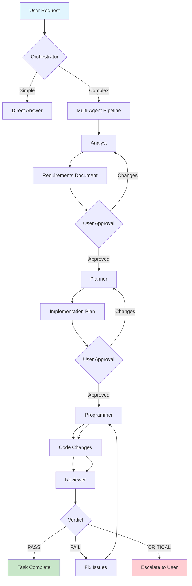
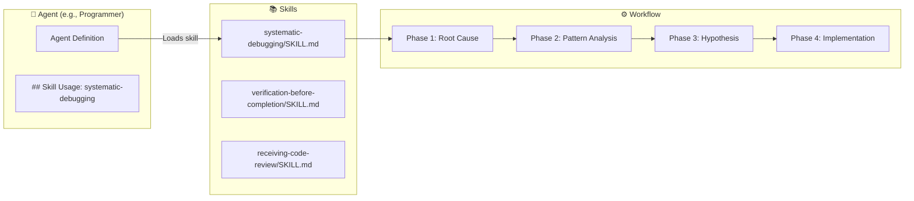

# devkit-agent

Multi-agent coding pipeline for OpenCode. Install agents and skills with one command.

## Installation

```bash
npx devkit-agent
```

## Quick Start

```bash
# Interactive install (recommended)
npx devkit-agent

# Install to global scope
npx devkit-agent -g

# Install all agents without prompts
npx devkit-agent -g -y

# Uninstall
npx devkit-agent -u
```

## How It Works

### Multi-Agent Pipeline

When you give a complex task, the Orchestrator routes it through a pipeline of specialist agents:

```
     ┌──────────────────────────────────────────────────────────┐
     │                     USER REQUEST                         │
     └──────────────────────────┬───────────────────────────────┘
                                │
                                ▼
     ┌──────────────────────────────────────────────────────────┐
     │                     ORCHESTRATOR                         │
     │               (Manager & Team Lead)                      │
     │                                                          │
     │  • Assesses complexity (DIRECT vs MULTI-AGENT)           │
     │  • Routes to specialist agents                           │
     │  • Manages approval checkpoints                          │
     │  • Hub-and-spoke communication                           │
     └──────────────────┬────────┬───────────┬──────────────────┘
                        │        |           │
            ┌───────────┘        |           └───────────────────┐
            │                    |                               │
            ▼                    ▼                               ▼
   ┌─────────────────┐  ┌─────────────────┐       ┌─────────────────┐
   │     ANALYST     │  │     PLANNER     │       │   PROGRAMMER    │
   │                 │  │                 │       │                 │
   │ • Requirements  │  │ • Task breakdown│       │ • Code writing  │
   │ • Clarification │  │ • Dependencies  │       │ • Implementation│
   │ • Documentation │  │ • Risk analysis │       │ • Testing       │
   └────────┬────────┘  └────────┬────────┘       └────────┬────────┘
            │                    │                         │
            │                    │                         ▼
            │                    │                ┌─────────────────┐
            │                    │                │    REVIEWER     │
            │                    │                │                 │
            │                    │                │ • Code review   │
            │                    │                │ • Quality check │
            │                    │                │ • Security scan │
            │                    │                └────────┬────────┘
            │                    │                         │
            ▼                    ▼                         ▼
   ┌───────────────────────────────────────────────────────────────────────┐
   │                              SESSION ARTIFACTS                        │
   │                                                                       │
   │   .knowledge/sessions/<session-id>/                                   │
   │     ├── status.md        ← Session state tracking                     │
   │     ├── requirements.md  ← Analyst output                             │
   │     ├── plan.md          ← Planner output                             │
   │     └── review.md        ← Reviewer output                            │
   └───────────────────────────────────────────────────────────────────────┘
```

### Pipeline Flow



### Agent & Skill Mapping

Each agent has specialized skills they can load at runtime :

```
┌──────────────────────────────────────────────────────────────────────────┐
│                          AGENT-SKILL MAP                                 │
├──────────────────────────────────────────────────────────────────────────┤
│                                                                          │
│  ORCHESTRATOR ──────────────┬── subagent-driven-development              │
│       │                     │                                            │
│       ├──► ANALYST ─────────┼── brainstorming                            │
│       │                     │                                            │
│       ├──► PLANNER ─────────┼── writing-plans                            │
│       │                     │                                            │
│       ├──► PROGRAMMER ──────┼── receiving-code-review                    │
│       │                     ├── verification-before-completion           │
│       │                     └── systematic-debugging                     │
│       │                                                                  │
│       └──► REVIEWER ────────┼── requesting-code-review                   │
│                             ├── verification-before-completion           │
│                             └── systematic-debugging                     │
│                                                                          │
└──────────────────────────────────────────────────────────────────────────┘
```

### Skills in Action

Skills are reusable instruction sets that agents load at runtime. Each skill can be used by multiple agents.



## Options

| Flag | Description |
|------|-------------|
| `-g, --global` | Install to global scope (`~/.config/opencode/`) |
| `-u, --uninstall` | Uninstall agents and skills |
| `-y, --yes` | Skip confirmation prompts |
| `-h, --help` | Show help message |

## Installation Scope

| Scope | Agents Path | Skills Path |
|-------|-------------|-------------|
| Project (default) | `.opencode/agents/` | `.opencode/skills/` |
| Global | `~/.config/opencode/agents/` | `~/.config/opencode/skills/` |

## Agents

| Agent | Role | Skills |
|-------|------|--------|
| **Orchestrator** | Manager & team lead | subagent-driven-development |
| **Analyst** | Requirement analysis | brainstorming |
| **Planner** | Implementation planning | writing-plans |
| **Programmer** | Code implementation | receiving-code-review, verification-before-completion, systematic-debugging |
| **Reviewer** | Code review & testing | requesting-code-review, verification-before-completion, systematic-debugging |

## Skills

| Skill | Description |
|-------|-------------|
| **brainstorming** | Structured requirement analysis and design exploration |
| **writing-plans** | Creates detailed implementation plans with TDD tasks |
| **subagent-driven-development** | Dispatches subagents with two-stage review |
| **systematic-debugging** | Root cause investigation and scientific debugging |
| **verification-before-completion** | Evidence-based completion verification |
| **receiving-code-review** | Handles review feedback with technical rigor |
| **requesting-code-review** | Code review methodology and best practices |

## Examples

### Install for Current Project

```bash
cd my-project
npx devkit-agent
```

This creates:
```
my-project/
└── .opencode/
    ├── agents/
    │   ├── orchestrator.md
    │   ├── analyst.md
    │   ├── planner.md
    │   ├── programmer.md
    │   └── reviewer.md
    └── skills/
        ├── brainstorming/
        │   └── SKILL.md
        ├── writing-plans/
        │   └── SKILL.md
        └── ...
```

### Install Globally

```bash
npx devkit-agent -g
```

This creates:
```
~/.config/opencode/
├── agents/
│   └── *.md
└── skills/
    └── */SKILL.md
```

### Uninstall Specific Agents

```bash
npx devkit-agent -u
```

The CLI will:
1. Detect installed agents
2. Let you select which to remove
3. Smart cleanup: only remove skills no longer needed by remaining agents

## Requirements

- Node.js >= 18
- OpenCode (any supported agent)

## License

MIT

## Links

- [GitHub Repository](https://github.com/rifanstd/devkit-agent)
- [OpenCode Documentation](https://opencode.ai)
